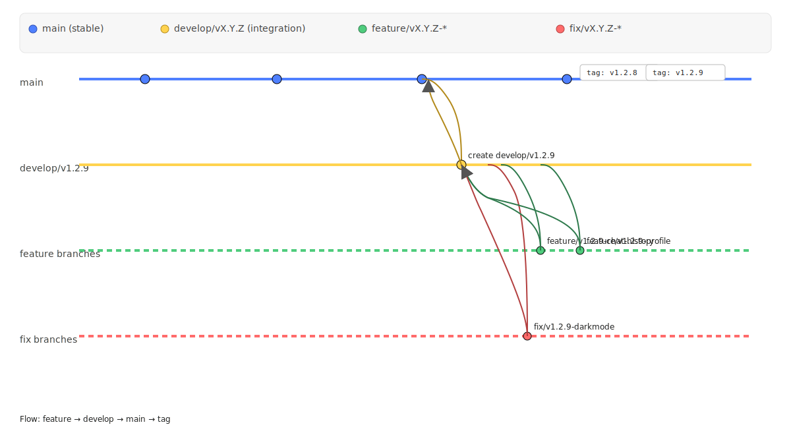

# Muse Chat Branching Flow

This folder documents the branching model used in Muse Chat.

## Diagram

  

## Branch Roles

- <strong>main</strong>: Stable, production-ready branch. Releases are tagged here (e.g., <code>v1.2.8</code>).
- <strong>develop/vX.Y.Z</strong>: Integration branch for a milestone (e.g., <code>develop/v1.2.9</code>). All features/fixes for that version merge here first.
- <strong>feature/vX.Y.Z-*</strong>: Short-lived branches for new features (e.g., <code>feature/v1.2.9-chat-history</code>).
- <strong>fix/vX.Y.Z-*</strong>: Short-lived branches for bug fixes during the milestone (e.g., <code>fix/v1.2.9-darkmode</code>).

## Example Flow

1. Create integration branch for milestone: <code>develop/v1.2.9</code>
2. Create feature branches off develop: <code>feature/v1.2.9-chat-history</code>, etc.
3. Merge features into develop with <code>--no-ff</code>:
   <pre>git checkout develop/v1.2.9
git merge feature/v1.2.9-chat-history --no-ff -m "Merge chat history feature"</pre>
4. When stable, merge develop → main and tag the release:
   <pre>git checkout main
git merge develop/v1.2.9 --no-ff -m "Merge v1.2.9 milestone"
git tag -a v1.2.9 -m "Release v1.2.9"
git push origin main --tags</pre>

## Quick Reference: Naming Conventions

<table>
  <thead>
    <tr><th>Branch Type</th><th>Pattern</th><th>Example</th></tr>
  </thead>
  <tbody>
    <tr><td>Feature</td><td><code>feature/&lt;version&gt;-&lt;name&gt;</code></td><td><code>feature/v1.2.9-chat-history</code></td></tr>
    <tr><td>Fix</td><td><code>fix/&lt;version&gt;-&lt;desc&gt;</code></td><td><code>fix/v1.2.9-darkmode</code></td></tr>
    <tr><td>Experiment</td><td><code>experiment/&lt;topic&gt;</code></td><td><code>experiment/rag-engine</code></td></tr>
    <tr><td>Hotfix</td><td><code>hotfix/&lt;version&gt;</code></td><td><code>hotfix/v1.2.8.1</code></td></tr>
  </tbody>
</table>

---
© 2025 Muse Chat
